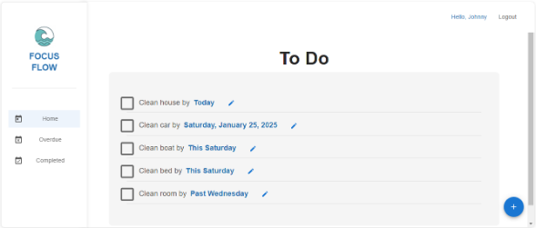
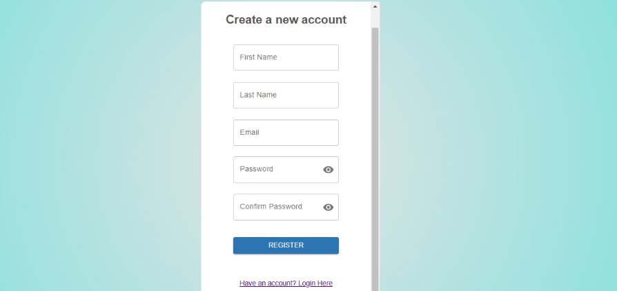
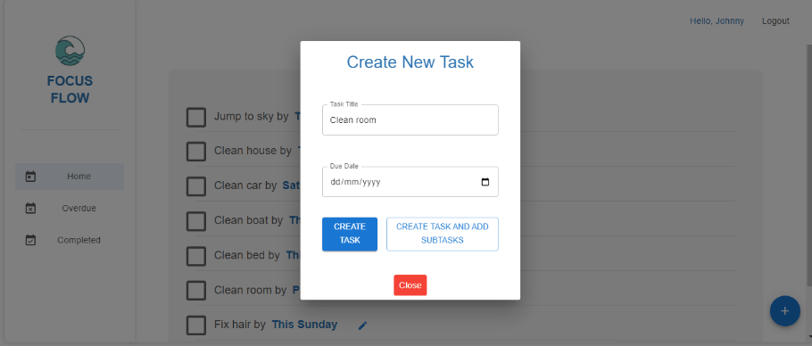
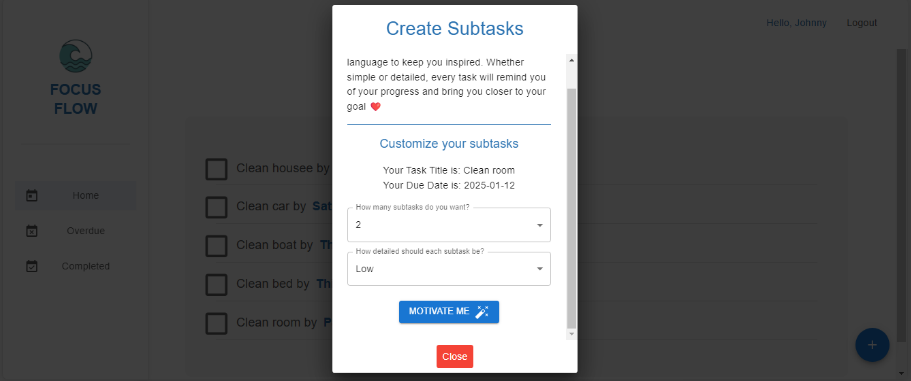
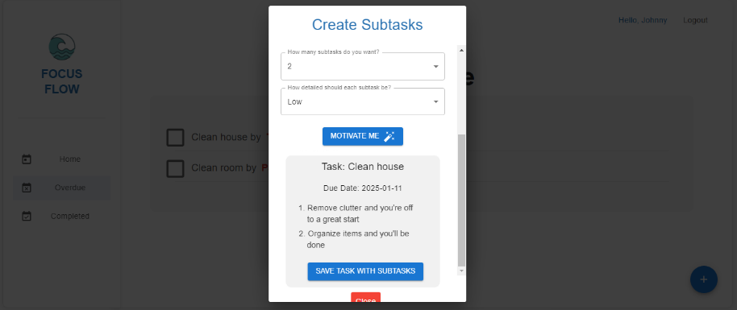
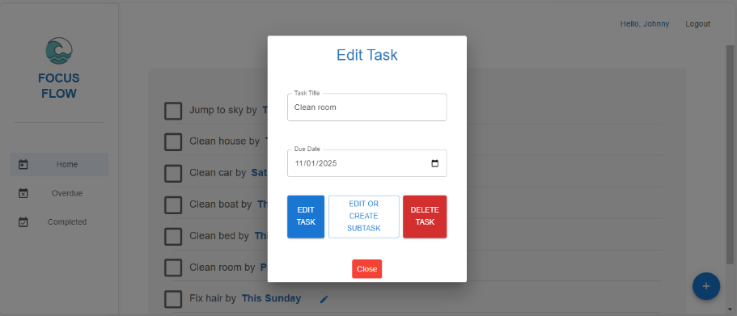
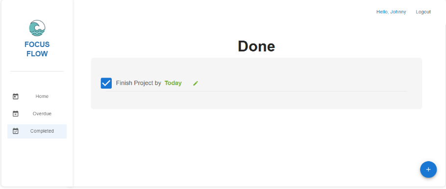
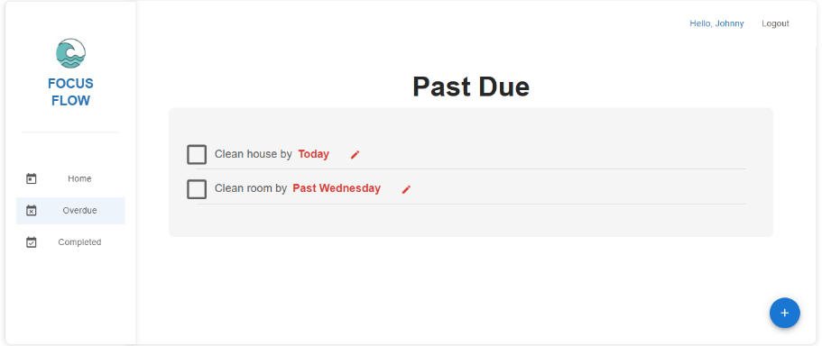

Here is the updated version of your project documentation **with all Docker-related instructions and references removed**:

---

# FocusFlow - AI Powered Task Management App

FocusFlow is a web-based task management app designed to assist users, particularly those with ADHD, by breaking down tasks into smaller, manageable steps. The app integrates the **SmolLM2-135M-INSTRUCT** model, which is used to help users deconstruct complex tasks into more digestible and motivational sub-tasks.

---

## Features

* **Task Management**: Create, update, delete and track tasks.
* **Task Breakdown**: Automatically generate sub-tasks based on a given task using a LLM (SmolLM2-135M-INSTRUCT).
* **User-Friendly Interface**: Simple and intuitive frontend built with React.
* **LLM Integration**: Uses a custom-trained language model to break down complex tasks.
* **MySQL Database**: Stores user data and tasks.

---

## Images

**Home**
The main dashboard of FocusFlow, providing an overview of tasks and productivity insights.


**Login**
The user authentication page allowing registered users to securely log into FocusFlow.


**Register**
The sign-up page where new users can create an account to start managing their tasks.


**New Task**
A dedicated page for users to add new tasks with deadlines, priorities, and categories.


**Subtasks**
Allows users to break down complex tasks into smaller, manageable subtasks for better organization using AI.


**Subtask Created**
A confirmation page showing that a subtask has been successfully added to a main task.


**Edit Task**
Users can modify task details such as due date, priority, and description.


**To-Do Subtask**
Displays a list of pending subtasks that need to be completed before the main task is done.


**Done**
Shows completed tasks and subtasks, helping users track their productivity.


**Past Due**
A section highlighting overdue tasks that need urgent attention.


---

## Project Structure

```
project/
├── backend/                    # Django backend
│   ├── requirements.txt         # Backend dependencies
│   └── taskapp/                 # Django app folder
├── frontend/                    # React frontend
│   ├── package.json             # Frontend dependencies
│   ├── package-lock.json        # Lock file for React dependencies
│   └── public/                  # Public directory for React
│   └── src/                     # Source code for React
├── llm/                         # LLM model directory
│   ├── requirements.txt         # LLM module dependencies
│   ├── merged_model/            # Contains the SmolLM2-135M-INSTRUCT model and tokenizers
│   └── testsmol135.ipynb        # Jupyter notebook for LLM module
```

---

## Requirements

Before running the project, ensure you have the following installed:

* Python (recommended: 3.10+)
* Node.js & npm
* MySQL Server

---

## Setup Instructions

### 1. **Clone the Repository**

```bash
git clone https://github.com/nekesa-w/focusflow_taskapp
cd focusflow_taskapp/
```

### 2. **Set Up the Backend (Django)**

Install Python dependencies:

```bash
cd backend/
pip install -r requirements.txt
```

Configure your MySQL database and ensure the Django `settings.py` uses:

```python
DATABASES = {
    "default": {
        "ENGINE": "django.db.backends.mysql",
        "NAME": "taskapp",
        "USER": "root",
        "PASSWORD": "",  # update with your password if any
        "HOST": "localhost",
        "PORT": "3306",
        "OPTIONS": {
            "init_command": "SET default_storage_engine=INNODB",
        },
    }
}
```

Run database migrations:

```bash
python manage.py makemigrations
python manage.py migrate
```

Start the backend server:

```bash
python manage.py runserver
```

### 3. **Set Up the Frontend (React)**

Install frontend dependencies:

```bash
cd frontend/
npm install
```

Start the development server:

```bash
npm run dev
```

Access the app at `http://localhost:5173`

### 4. **Run the LLM Notebook**

To experiment with the AI model:

```bash
cd llm/
pip install -r requirements.txt
jupyter notebook
```

Then open the `testsmol135.ipynb` notebook in your browser to test and interact with the model.

---

## License

This project is licensed under the MIT License - see the [LICENSE](LICENSE) file for details.

---

Let me know if you'd also like help converting the backend to SQLite or PostgreSQL for simpler local development!
